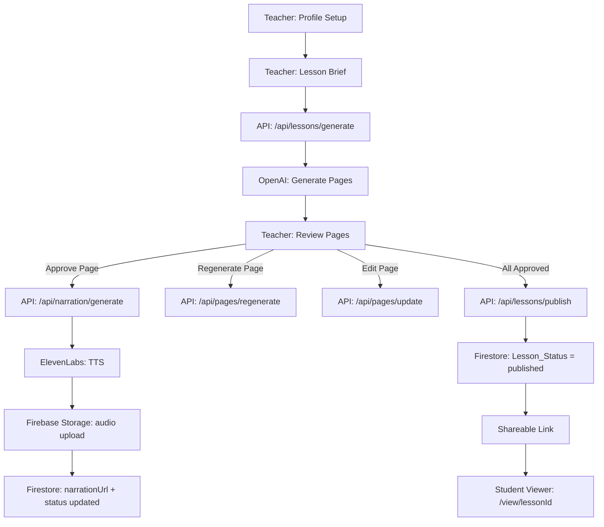

# Design Document: AI Lesson Planner

## Overview

The AI Lesson Planner is a single-user, hackathon-scoped web app built with Next.js (App Router). A teacher provides their profile and a lesson brief; the AI generates a multi-page lesson; the teacher reviews, edits, and approves pages; narration audio is baked in at approval time via ElevenLabs; and the teacher publishes a shareable link that opens a clean student viewer.

There are no user accounts. All teacher state (profile, voice profile, lessons) is persisted in **Firestore**, and narration audio is stored in **Firebase Storage**. API routes use the Firebase Admin SDK for all server-side reads and writes. The Firestore structure is intentionally flat and simple — no user-scoped paths — appropriate for a single-user hackathon demo.

### Key Design Decisions

| Decision | Choice | Rationale |
|---|---|---|
| Auth | None | Single-user demo; no accounts needed |
| Persistence | Firestore | Simple document/collection model, no server file I/O, easy to inspect in Firebase console |
| Audio storage | Firebase Storage | Managed hosting with download URLs; no static file serving setup required |
| Narration timing | Generated at page approval | Audio is ready the moment the lesson is published |
| Voice profile scope | Global, single profile | Reused across all lessons; one-time setup |
| Post-publish edits | Immediate, no re-approval | Keeps the teacher workflow frictionless |
| Student viewer | Separate route, read-only | Clean separation of teacher and student UX |

---

## Architecture

### High-Level Flow



### Firebase Initialization

The Firebase Admin SDK is initialized once in a shared server-side module (`lib/firebase-admin.ts`) and imported by all API routes. Credentials are read from environment variables:

| Variable | Purpose |
|---|---|
| `FIREBASE_PROJECT_ID` | Identifies the Firebase project |
| `FIREBASE_CLIENT_EMAIL` | Service account email |
| `FIREBASE_PRIVATE_KEY` | Service account private key (newlines escaped as `\n`) |

```typescript
// lib/firebase-admin.ts
import { initializeApp, getApps, cert } from "firebase-admin/app";
import { getFirestore } from "firebase-admin/firestore";
import { getStorage } from "firebase-admin/storage";

if (!getApps().length) {
  initializeApp({
    credential: cert({
      projectId: process.env.FIREBASE_PROJECT_ID,
      clientEmail: process.env.FIREBASE_CLIENT_EMAIL,
      privateKey: process.env.FIREBASE_PRIVATE_KEY?.replace(/\\n/g, "\n"),
    }),
    storageBucket: `${process.env.FIREBASE_PROJECT_ID}.appspot.com`,
  });
}

export const db = getFirestore();
export const storage = getStorage();
```

### Next.js App Router Structure

```
app/
  page.tsx                        # Teacher home — profile check + lesson list
  setup/
    page.tsx                      # Teacher profile setup
  lessons/
    new/
      page.tsx                    # Lesson brief input form
    [lessonId]/
      page.tsx                    # Lesson review (per-page approve/edit/regen)
  view/
    [lessonId]/
      page.tsx                    # Student viewer (read-only)
  api/
    lessons/
      route.ts                    # GET (list), POST (create + trigger generation)
      [lessonId]/
        route.ts                  # GET, PATCH (update lesson), DELETE
        publish/
          route.ts                # POST — publish lesson
        pages/
          [pageId]/
            route.ts              # PATCH (manual edit)
            regenerate/
              route.ts            # POST — regenerate single page
            narration/
              route.ts            # POST — generate narration for page
    teacher/
      route.ts                    # GET, PUT — teacher profile
    voice/
      route.ts                    # GET, PUT — voice profile
      record/
        route.ts                  # POST — submit voice sample to ElevenLabs
```

### Component Structure

```
components/
  teacher/
    ProfileForm.tsx               # Grade, subject, tone fields
    VoiceSetup.tsx                # Record voice sample, show clone status
  lesson/
    BriefForm.tsx                 # Title, topic, objectives, inclusions
    PageCard.tsx                  # Single page display with approve/edit/regen
    PageEditor.tsx                # Inline edit form for a page
    PageList.tsx                  # Sidebar list of pages with status badges
    PublishBar.tsx                # Approve All + Publish CTA
    NarrationPlayer.tsx           # Audio player (teacher preview + student playback)
  viewer/
    StudentPage.tsx               # Read-only page display
    ViewerNav.tsx                 # Prev/Next navigation + page counter
  ui/                             # shadcn/ui re-exports and custom primitives
```

---

## Data Models

### TeacherProfile

```typescript
interface TeacherProfile {
  gradeLevel: string;          // "Kindergarten" | "Grade 1" … "Grade 12"
  subject: string;             // free text, e.g. "Biology"
  teachingTone: "Fun" | "Structured" | "Simple" | "Engaging";
}
```

### VoiceProfile

```typescript
interface VoiceProfile {
  type: "default" | "clone";
  elevenLabsVoiceId: string;   // default voice ID or cloned voice ID from ElevenLabs
  createdAt?: string;          // ISO timestamp, set when clone is created
}
```

### Page

```typescript
interface Page {
  id: string;                  // uuid
  order: number;               // 1-based position in lesson
  title: string;
  body: string;                // student-facing body content
  example: string;             // concrete example
  activity: string;            // activity or question
  status: "pending" | "approved";
  narrationUrl: string | null; // URL to generated audio file (null until approved)
}
```

### Lesson

```typescript
interface Lesson {
  id: string;                  // uuid, also used as the shareable link slug
  title: string;
  topic: string;
  objectives: string[];
  inclusions: string | null;   // optional
  status: "draft" | "published";
  pages: Page[];
  teacherProfile: TeacherProfile; // snapshot at generation time
  createdAt: string;           // ISO timestamp
  publishedAt: string | null;
}
```

### Firestore Structure

```
Firestore
├── teacher/
│   └── default                    # single document (doc ID: "default")
│       ├── profile: TeacherProfile | null
│       └── voiceProfile: VoiceProfile | null
│
└── lessons/
    └── {lessonId}                 # one document per Lesson
        ├── id: string
        ├── title: string
        ├── topic: string
        ├── objectives: string[]
        ├── inclusions: string | null
        ├── status: "draft" | "published"
        ├── pages: Page[]          # embedded array (simpler for demo)
        ├── teacherProfile: TeacherProfile
        ├── createdAt: string
        └── publishedAt: string | null
```

Pages are stored as an embedded array on the lesson document. For a hackathon demo with 5–8 pages per lesson this is well within Firestore's 1 MB document limit and avoids the overhead of a subcollection.

### Firebase Storage Structure

```
Firebase Storage
└── audio/
    └── {lessonId}/
        └── {pageId}.mp3
```

The `narrationUrl` on a `Page` is the Firebase Storage **download URL** returned after upload (a long-lived HTTPS URL). The student viewer fetches audio directly from this URL — no additional API layer required.

---

## Key API Routes

### `POST /api/lessons` — Create lesson and trigger generation

**Request body:**
```json
{
  "title": "Introduction to Photosynthesis",
  "topic": "How plants make food from sunlight",
  "objectives": ["Understand chlorophyll", "Explain the light reaction"],
  "inclusions": "Include a real-world analogy"
}
```

**Behavior:**
1. Reads `TeacherProfile` from the `teacher/default` Firestore document; returns 400 if not set.
2. Builds the AI prompt (see AI Integration section).
3. Calls OpenAI with streaming disabled; awaits full response.
4. Parses the JSON response into 5–8 `Page` objects, each with `status: "pending"` and `narrationUrl: null`.
5. Assigns a UUID to the lesson and each page.
6. Writes the lesson document to the `lessons` Firestore collection.
7. Returns the full `Lesson` object.

**Response:** `201 Created` with `Lesson`.

---

### `POST /api/lessons/[lessonId]/pages/[pageId]/regenerate` — Regenerate a single page

**Behavior:**
1. Loads the lesson from Firestore; extracts the original brief and teacher profile snapshot.
2. Calls OpenAI with a prompt to regenerate only that page (same brief, same profile, instruction to produce a different version).
3. Replaces page content in the embedded pages array; sets `status: "pending"`, clears `narrationUrl`.
4. Updates the lesson document in Firestore and returns the updated `Page`.

---

### `PATCH /api/lessons/[lessonId]/pages/[pageId]` — Manual page edit

**Request body:** Partial `Page` (title, body, example, activity).

**Behavior:**
1. Merges provided fields onto the existing page in the embedded pages array.
2. Sets `status: "pending"`, clears `narrationUrl`.
3. Updates the lesson document in Firestore and returns the updated `Page`.

---

### `POST /api/lessons/[lessonId]/pages/[pageId]/narration` — Generate narration

**Behavior:**
1. Reads the active `VoiceProfile` from the `teacher/default` Firestore document.
2. Concatenates page content: `{title}. {body} For example: {example}. Activity: {activity}`.
3. Calls ElevenLabs TTS API with the voice ID and concatenated text.
4. Uploads the returned audio buffer to Firebase Storage at `audio/{lessonId}/{pageId}.mp3`.
5. Retrieves the Firebase Storage download URL and sets `page.narrationUrl` to that URL.
6. Sets `page.status = "approved"`.
7. Updates the lesson document in Firestore and returns the updated `Page`.

This route is called automatically when the teacher clicks "Approve" on a page.

---

### `POST /api/lessons/[lessonId]/publish` — Publish lesson

**Behavior:**
1. Verifies all pages have `status: "approved"`; returns 400 if not.
2. Sets `lesson.status = "published"`, sets `publishedAt`.
3. The shareable link is simply `/view/{lessonId}` — the lesson ID is the slug.
4. Updates the lesson document in Firestore and returns the updated `Lesson`.

---

### `PUT /api/teacher` — Save teacher profile

Writes `TeacherProfile` to the `teacher/default` Firestore document. Returns 200.

---

### `POST /api/voice/record` — Submit voice sample for cloning

**Request body:** `multipart/form-data` with `audio` field (WAV/MP3, ≥30 seconds).

**Behavior:**
1. Forwards the audio file to ElevenLabs `POST /v1/voices/add`.
2. Stores the returned `voice_id` in `VoiceProfile` with `type: "clone"`.
3. Updates the `teacher/default` Firestore document with the new `VoiceProfile`.
4. Returns the updated `VoiceProfile`.

---

## ElevenLabs Integration

### Text-to-Speech (TTS)

- **Endpoint:** `POST https://api.elevenlabs.io/v1/text-to-speech/{voice_id}`
- **Called from:** `POST /api/lessons/[lessonId]/pages/[pageId]/narration`
- **Auth:** `xi-api-key` header from `ELEVENLABS_API_KEY` env var
- **Model:** `eleven_turbo_v2` (fast, good quality, cost-effective for demo)
- **Output format:** `mp3_44100_128`
- **Text construction:** Title + body + example + activity concatenated with natural connectors

```typescript
const text = `${page.title}. ${page.body} Here is an example: ${page.example}. Now try this: ${page.activity}`;
```

### Voice Clone Creation

- **Endpoint:** `POST https://api.elevenlabs.io/v1/voices/add`
- **Called from:** `POST /api/voice/record`
- **Payload:** `multipart/form-data` — `name: "Teacher Voice"`, `files: [audioBlob]`
- **Returns:** `{ voice_id: string }`
- **Fallback:** If this call fails, the app retains the default voice ID and shows an error toast.

### Default Voice

A hardcoded ElevenLabs voice ID is stored in an env var `ELEVENLABS_DEFAULT_VOICE_ID` (e.g., `Rachel` or `Adam`). This is used when no clone exists or when the teacher explicitly selects the default.

---

## AI Integration (OpenAI)

### Lesson Generation Prompt

```
You are an educational content writer. Generate a lesson for the following context.

Teacher Profile:
- Grade Level: {gradeLevel}
- Subject: {subject}
- Teaching Tone: {teachingTone}

Lesson Brief:
- Title: {title}
- Topic: {topic}
- Learning Objectives: {objectives joined by newline}
- Specific Inclusions: {inclusions or "None"}

Generate between 5 and 8 lesson pages. Each page must have:
- title: string
- body: string (student-facing content, grade-appropriate vocabulary)
- example: string (concrete, relatable example)
- activity: string (a question or short activity to reinforce the concept)

Respond with a JSON object: { "pages": [ { "title", "body", "example", "activity" } ] }
Do not include any text outside the JSON.
```

- **Model:** `gpt-4o` (or `gpt-4o-mini` for cost savings in demo)
- **Response format:** `{ type: "json_object" }` to guarantee parseable output
- **Called via:** OpenAI Node SDK with `response_format: { type: "json_object" }`

### Single Page Regeneration Prompt

```
You are an educational content writer. Regenerate ONE lesson page for the context below.
Produce a meaningfully different version — different angle, different example, different activity.

Teacher Profile: {same as above}
Lesson Brief: {same as above}
Page to regenerate: Page {order} of {total}

Respond with a JSON object: { "page": { "title", "body", "example", "activity" } }
```

---

## State Management

The app uses a simple, pragmatic state approach appropriate for a hackathon demo:

- **Server state** (lessons, pages, teacher profile, voice profile): persisted in Firestore, read/written by API routes via the Firebase Admin SDK.
- **Client state**: React `useState` / `useReducer` within page components. No global client state library.
- **Data fetching**: Native `fetch` calls to the API routes. No SWR or React Query — keep it simple.
- **Optimistic updates**: Not used. The UI waits for API responses before updating. Loading spinners cover the latency.
- **Teacher profile availability**: Checked on the home page; if absent, the user is redirected to `/setup`.

### Client-Side Flow for Page Approval

```
Teacher clicks "Approve"
  → POST /api/lessons/{id}/pages/{pageId}/narration
  → Loading spinner on page card
  → On success: page.status = "approved", page.narrationUrl set
  → NarrationPlayer appears for preview
  → If all pages approved: Publish button enables
```

---

## Student Viewer Route

**Route:** `/view/[lessonId]`

This is a fully separate Next.js page with no teacher UI elements. It is a Server Component that fetches the lesson on load, then hands off to a client component for navigation state.

**Behavior:**
1. Fetch lesson by ID from the store.
2. If `lesson.status !== "published"`, render a "This lesson is not yet available" message.
3. Otherwise render the `StudentPage` component for the first page.
4. Client-side `currentPageIndex` state drives prev/next navigation.
5. On page change, stop any playing audio (via `audio.pause()` on the `NarrationPlayer` ref).

**No API calls from the viewer** — the lesson data is fetched once at page load (Next.js server component fetch or a single `GET /api/lessons/[lessonId]` call). Audio is served directly from Firebase Storage download URLs stored on each page's `narrationUrl` field.

---

## Error Handling

| Scenario | Behavior |
|---|---|
| AI generation fails | Toast error + "Retry" button; lesson stays in draft with no pages |
| Single page regeneration fails | Error shown on that page card; previous content restored |
| ElevenLabs TTS fails | Toast error on page card; page stays `pending`; "Retry narration" button shown |
| Voice clone creation fails | Toast error; falls back to default voice; teacher can retry from voice settings |
| Student opens unpublished link | Viewer shows "Lesson not yet available" message |
| Narration audio missing in viewer | Play button hidden; no error shown to student |
| Teacher profile missing | Redirect to `/setup` before any lesson creation is allowed |

---

## Testing Strategy

### Unit Tests

Focus on pure logic functions:
- Prompt construction (given a `TeacherProfile` + `Lesson_Brief`, verify the prompt string contains expected fields)
- Page content concatenation for TTS (verify the text sent to ElevenLabs is correctly assembled)
- Lesson/page status transition logic (approve, publish validation)
- Validation functions (empty brief fields, incomplete profile)

### Property-Based Tests

See Correctness Properties section below. Use **fast-check** (TypeScript-native PBT library) with a minimum of 100 iterations per property.

Tag format: `// Feature: ai-lesson-planner, Property {N}: {property_text}`

### Integration Tests

- `POST /api/lessons` with a mocked OpenAI response → verify lesson structure written to Firestore
- `POST /api/.../narration` with mocked ElevenLabs and Firebase Storage responses → verify download URL stored on page and page status updated in Firestore
- `POST /api/voice/record` with a mocked ElevenLabs clone endpoint → verify voice profile stored in `teacher/default` Firestore document

### Manual / Demo Testing

Given the hackathon scope, end-to-end flows are verified manually:
- Full teacher flow: profile → brief → review → approve all → publish → copy link
- Student flow: open shareable link → navigate pages → play narration
- Voice clone flow: record sample → verify clone voice used on next approval

---

## Correctness Properties

*A property is a characteristic or behavior that should hold true across all valid executions of a system — essentially, a formal statement about what the system should do. Properties serve as the bridge between human-readable specifications and machine-verifiable correctness guarantees.*

Use **fast-check** for all property-based tests. Minimum 100 iterations per property. Tag each test with:
`// Feature: ai-lesson-planner, Property {N}: {property_text}`

---

### Property 1: Incomplete teacher profile blocks lesson creation

*For any* `TeacherProfile` object missing at least one required field (gradeLevel, subject, or teachingTone), the profile validation function SHALL return an invalid result that identifies the missing field(s).

**Validates: Requirements 1.5**

---

### Property 2: Whitespace-only or empty brief fields are rejected

*For any* `Lesson_Brief` where any required field (title, topic, or objectives array) is empty, null, or composed entirely of whitespace characters, the brief validation function SHALL reject the input and identify the offending field.

**Validates: Requirements 2.1, 2.2, 2.3, 2.6**

---

### Property 3: Prompt construction includes all profile and brief fields

*For any* valid `TeacherProfile` and complete `Lesson_Brief`, the prompt construction function SHALL produce a non-empty string that contains the grade level, teaching tone, lesson title, topic, and every learning objective as substrings.

**Validates: Requirements 3.2, 3.3**

---

### Property 4: Generated pages are well-formed and start as pending

*For any* parsed AI response containing between 5 and 8 pages, every page SHALL have non-empty title, body, example, and activity fields, and every page SHALL have `status: "pending"` and `narrationUrl: null`.

**Validates: Requirements 3.4, 3.5**

---

### Property 5: Any page content change resets status to pending and clears narration

*For any* `Page` (regardless of current status), applying any content modification (non-empty change to title, body, example, or activity) SHALL result in `status: "pending"` and `narrationUrl: null`.

**Validates: Requirements 5.3, 6.3, 8.5**

---

### Property 6: Approve All sets every page to approved

*For any* `Lesson` with any mix of `pending` and `approved` pages, applying the Approve All operation SHALL result in every page having `status: "approved"`.

**Validates: Requirements 7.2**

---

### Property 7: Publish is blocked while any page is pending; enabled when all are approved

*For any* `Lesson`, the publish validation function SHALL return false if and only if at least one page has `status: "pending"`, and SHALL return true if and only if every page has `status: "approved"`.

**Validates: Requirements 8.1, 8.2, 4.4**

---

### Property 8: Page TTS text contains all four page sections

*For any* `Page` with non-empty title, body, example, and activity, the TTS text construction function SHALL produce a string that contains all four field values as substrings.

**Validates: Requirements 10.2**

---

### Property 9: Viewer navigation displays correct page number and total

*For any* `Lesson` with N pages (N ≥ 1) and any current page index i (0 ≤ i < N), the viewer navigation display function SHALL produce output indicating page number `i + 1` and total `N`.

**Validates: Requirements 9.4**

---
